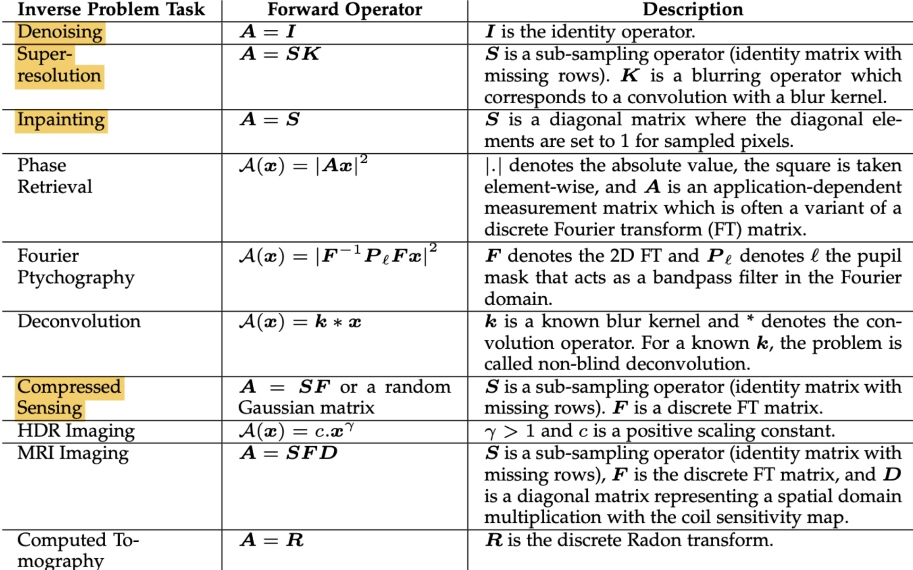

# Double-Over-Parameterization-DIP
Project for impletion of different image recovery task with Double Over-Parameterization DIP. We introduced new loss function and optimization 
method for traditional DIP, which aims to get rid of over-fitting phenomenon.

## Run the code
we prepare the scripts in ./scripts for different task. The script will run the model in baseline mode and 
double-over parameterization mode and compare the result in tensorboard log.

For example, if you want to try our method on Super Resolution Task and have prepared the environment,  run

````
bash super_resolution.sh
````
If you want to run the task with your own configuration, run
````
python ./trainer/task.py --config your_config.json
````
The template config file could be seen in ./config/template.json

## Structure
### config
The config file for different task will be implemented here. See template.json
### log
The output in the format of tensorboard log will be stored here. We store the main metric like loss, PSNR and output figure in the log.
### models
Include Unet Skip and other model used in different task of DIP
### scripts
Include the running script provided by us to reimplement the result of ours
### tranier
Include the main code for training process of different task.
### utils
Include all the common utils and specific utils used by different task

Our project will include all the tasks listed here:
